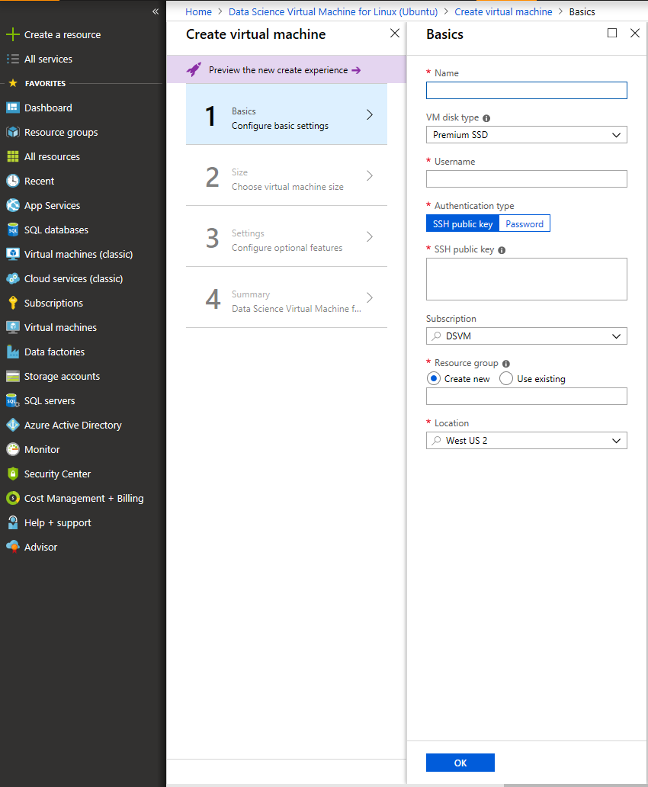
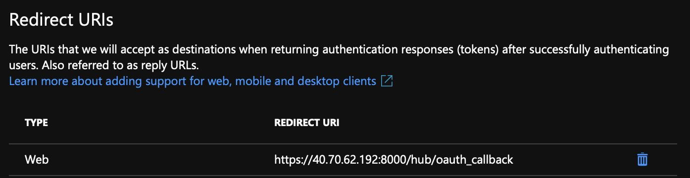
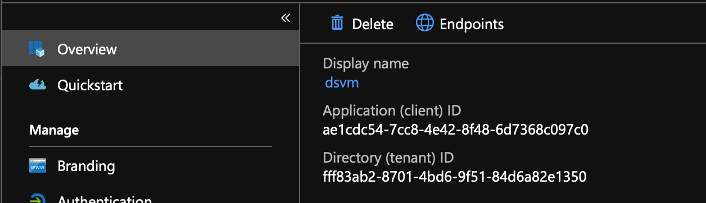
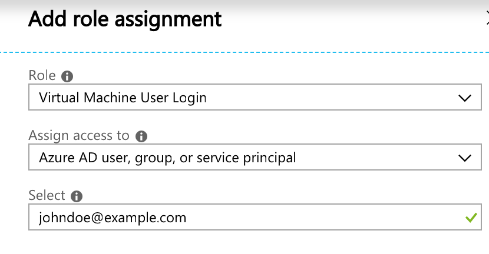
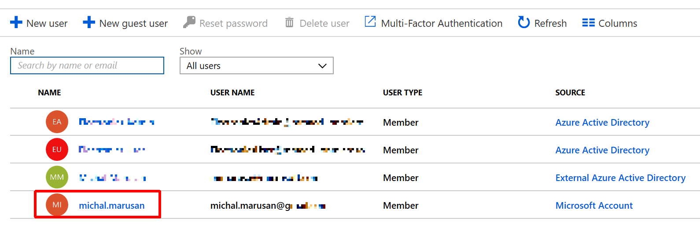
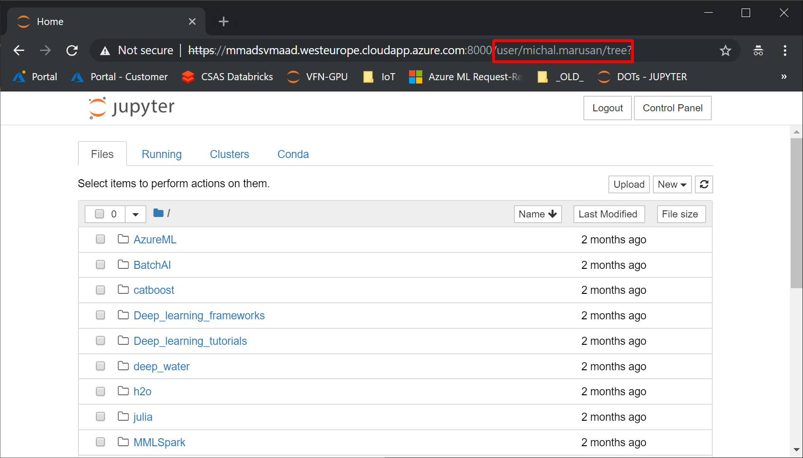
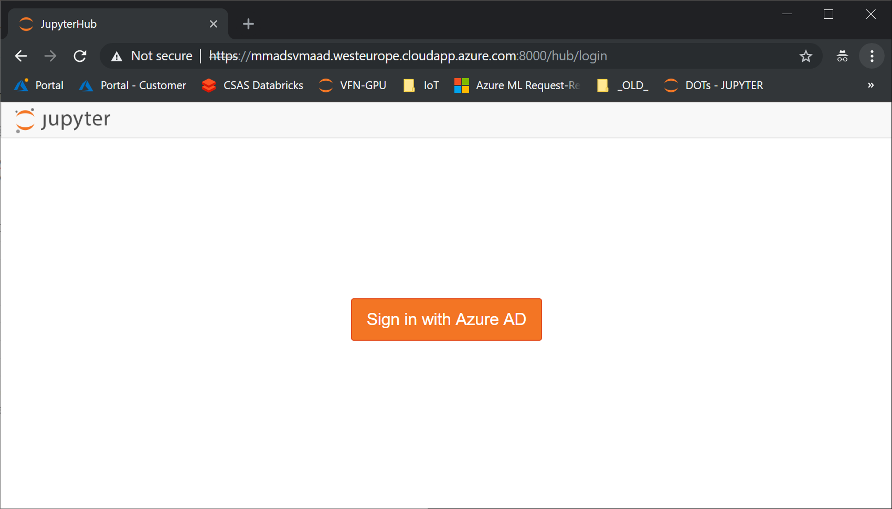

# Create DSVM (Linux) with AAD and Authenticate with AAD to JupyterHub

Simple guide on how to enable Azure Active Directory (AAD) integration with LInux DSVM and using JupyterHub.

## Motivation

The [Data Science Virtual Machine (DSVM)]( https://docs.microsoft.com/en-us/azure/machine-learning/data-science-virtual-machine/overview) is a virtual machine image available on Azure that is pre-installed with a collection of tools commonly used for data analytics and machine learning. The VM image makes it easy to get started doing data science in minutes, without having to install and configure each of the tools individually. You can easily scale up the VM, if needed, and stop it when not in use. So this resource is both elastic and cost-efficient.

The DSVM comes with a Jupyter notebook environment, to share Python, R, or Julia code and analysis. The Jupyter notebook is accessed through JupyterHub. Out of the box, users sign in using a local Linux user name and password.

In enterprise environments, managing local users and passwords on different systems is inconvenient. In addition, it creates a security risk as any user with root access to the machine can intercept user passwords in clear.

The [DSVM can be connected to Active Directory Domain Services](https://blogs.msdn.microsoft.com/uk_faculty_connection/2017/06/12/using-dsvm-jupyterhub-with-aad-authentication/) using LDAP. However, Domain Services are not always available on the cloud in enterprise environments, and can be cumbersome to set up and synchronize.

An [OAuth plugin for JupyterHub](https://github.com/jupyterhub/oauthenticator#azure-setup) is available on GitHub. It integrates with Azure Active Directory (AAD) to provide secure authentication for JupyterHub. However, it is not sufficient, as JupyterHub spawns Jupyter notebook processes under the signed-in user's account, users must also have local Linux user accounts.

Fortunately, [Linux VMs can be integrated with Azure Active Directory](https://docs.microsoft.com/en-us/azure/virtual-machines/linux/login-using-aad) as well. Thus the JupyterHub OAuth plugin and the AAD extension for Linux can be combined to enable multi-user data science environments without manually managing users and passwords.

An alternative to DSVMs is to use [https://docs.microsoft.com/en-us/azure/azure-databricks/](Azure Databricks), which provide a notebook environment for Python, R and Scala fully integrated with Azure Active Directory with fine-grained Role-Based Access Control.

## How-to Guide

### Step 1 - Create a DSVM

In your Azure subscription, [create a Data Science Virtual Machine for Linux](https://docs.microsoft.com/en-us/azure/machine-learning/data-science-virtual-machine/dsvm-ubuntu-intro#create-your-data-science-virtual-machine-for-linux).



### Step 2 - Add AAD MV extension

Apply the [extension to allow AAD login to VM] (https://docs.microsoft.com/en-us/azure/virtual-machines/linux/login-using-aad#install-the-azure-ad-login-vm-extension).

```
az vm extension set \
    --publisher Microsoft.Azure.ActiveDirectory.LinuxSSH \
    --name AADLoginForLinux \
    --resource-group YOUR_RESOURCE_GROUP \
    --vm-name YOUR_VM_NAME
```

### Step 3 - Create AAD application

[Create an Azure AD application following these instructions] https://docs.microsoft.com/en-us/azure/active-directory/develop/howto-create-service-principal-portal.

As Sign-on URL, enter 'https://<YOUR_VM_IP>:8000/hub/oauth_callback'.



Take note of the Directory ID and Application ID (Client ID) and create a Key (Client Secret).



### Step 4 - Setup JupyterHub AAD Login 

Follow instructions in [OAuthenticator instructions](https://github.com/jupyterhub/oauthenticator#azure-setup).

SSH to the DSVM and install OAuthenticator and PyJWT:

```
pip3 install oauthenticator PyJWT
```

Configure OAuthenticator in /etc/jupyterhub/jupyterhub_config.py. The Return URL must match the application configuration.

```
import os
os.environ["AAD_TENANT_ID"] = 'fff83ab2-8701-4bd6-9f51-84d6a82e1350'

from oauthenticator.azuread import AzureAdOAuthenticator
c.JupyterHub.authenticator_class = AzureAdOAuthenticator
c.Application.log_level = 'DEBUG'
c.AzureAdOAuthenticator.oauth_callback_url = 'https://40.70.62.192:8000/hub/oauth_callback'
c.AzureAdOAuthenticator.client_id = 'ae1cdc54-7cc8-4e42-8f48-6d7368c097c0'
c.AzureAdOAuthenticator.client_secret = '61s$.8I5yiD@+)#k>&yJW*'
```

### Step 5 - Configuration fixes

With data setting I was not able to login via my AAD login. I needed to make additional configuration:
1. Alter jupyterhub_config.py - add SudoSpawner (`https://github.com/jupyterhub/jupyterhub/issues/1527`) for admin at the VM
    ```
    c.JupyterHub.spawner_class = 'sudospawner.SudoSpawner'
    c.Spawner.cmd = '/home/admin_account/.local/bin/sudospawner'
    ```

2. User must login to VM with AAD first. Grant the user login permissions to the Virtual Machine:



Then ask the user to SSH to the VM.

The name on the User AD Record is the one, which is used as profile to JupyterHub:



3. I needed to create Linux user to match the AAD user name (without @abc.com)

`sudo adduser jon.doe`

> note: if your AAD username contains non-alphanumerical characters (such as ".") you need to allow that by changing `adduser.conf`: 
>
> `sudo nano /etc/adduser.conf`
>
> change:
>
> `NAME_REGEX='^[a-z][-.a-z0-9]*$'`



4. I needed to CHOWN notebooks directory to linux User

`sudo chmod 777 /data/home/jon.doe/`


5. test running JupyterHub with config file explicitly

`jupyterhub -f /etc/jupyterhub/jupyterhub_config.py`

Result:


